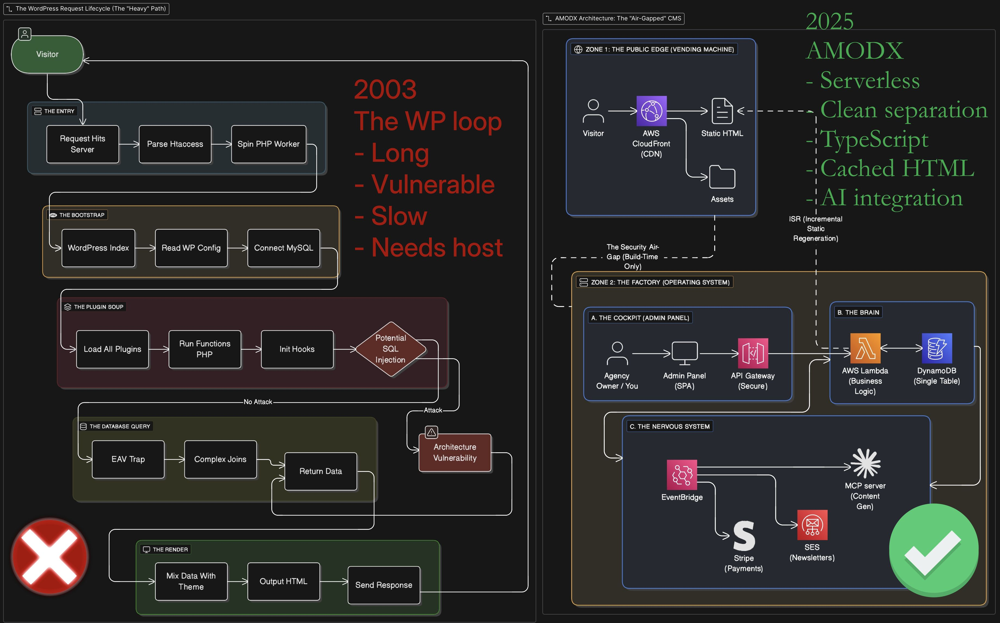

# AMODX: The Agency Operating System

> **Turn your agency into a software company.**



AMODX is a **Serverless Command Center** that allows you to manage up to 99 client sites, generate high-fidelity content via AI, and control access gates (paywalls/logins) from **one single dashboard.**

* Clean, secure, and modern.
* Extremely cheap to run: AWS Lambdas, Cognito, DynamoDB, EventBridge, S3.
* AI first: capture context in the platform and hook up Claude to the MCP server to generate content.

**One Deployment = One Agency.** You manage 99 client sites ("Tenants") from a single dashboard.

This is not for everyone. It's for you if you are technically inclined, you appreciate precision and you want to iterate fast - and don't want headaches.

---


## ⚡ Why AMODX?

### 1. Chat with your Business (The AI Bridge)
This is the killer feature. Because AMODX runs on an open protocol (MCP), you can connect **Claude Desktop** directly to your agency's infrastructure.

*   **Don't click buttons.** Just type: *"Create a new site for Dr. Smith, apply the 'Blue Medical' theme, and write a landing page based on our Dental Implants Strategy."*
*   **Context-Aware.** The AI knows your strategy, personas, and brand voice. It doesn't write generic fluff; it writes *your* content.

### 2. Infinite Scale, Zero Gunk
*   **No Servers:** We use AWS Serverless. You pay only for what you use. No idle costs.
*   **No Maintenance:** No plugins to update. No PHP versions to manage. No security patches for 50 different WordPress installs.
*   **Instant Publishing:** Changes go live instantly globally via our warm-cache architecture.

### 3. SEO Native
*   **Performance:** Sites score 100/100 on Core Web Vitals because they are pre-rendered static HTML.
*   **AI Ready:** Automatically generates `/llms.txt` so AI Search Engines (Perplexity, SearchGPT) rank your clients higher.

---

## 🚀 Getting Started

### 1. Setup Your Environment
If this is your first time using AWS tools, read the **[Installation Guide](INSTALL.md)**.

### 2. Deploy Your Infrastructure
Run one command to provision your entire agency backend.

```bash
npm install
npm run setup-config # Generates your config file
cd infra
npx cdk deploy
```

*The terminal will output your **Admin URL**. Save this.*

### 3. Access Your Command Center
1.  Open the **Admin URL**.
2.  Log in (First user created via AWS Console).
3.  **Create your first Client Site** via the Sidebar.

### 4. Connect With Claude Desktop
To enable the AI capabilities:
1.  Get your Master API Key from AWS Secrets Manager (created during deploy).
2.  Run the setup script:
    ```bash
    cd tools/mcp-server
    npm run build
    npm run setup
    ```

### 5. Running a Business
Read the **[Agency Operations Manual](AGENCY-MANAGEMENT.md)** for details on:
*   Connecting Custom Domains (e.g., `client.com`).
*   Managing SSL Certificates.
*   Scaling past 100 clients.

---

## 📜 License

Licensed under the **Apache 2.0 License**.
