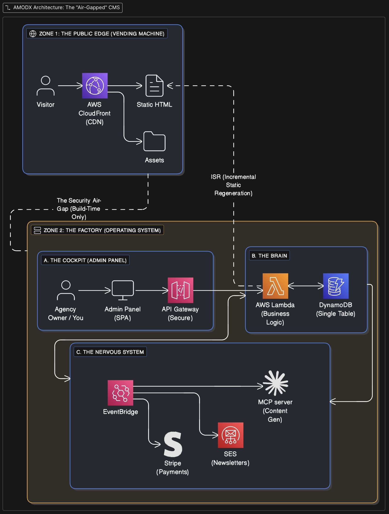

# AMODX System Architecture Specification (v2.2)

**Project Name:** AMODX (Agency Management On Demand Extreme)

**Vision:** A Serverless, AI-Native Operating System for Agencies. One Deployment = Infinite Sites.

**Philosophy:** "Notion for Agencies." We do not paint pixels; we assemble structured **Blocks**.

---

## 1. Module: `packages/shared` (The Contract)
**Status:** ✅ Implemented.

**Purpose:** Single source of truth for base types.

### Core Data Models
*   **`TenantConfig`**: Defines Site Settings, Theming (WP Parity - Colors, Fonts, Radius), Integrations, and Navigation.
*   **`ContentItem`**: Represents a Page. Contains a list of **Blocks**.
*   **`AccessPolicy`**: Defines Gating Logic.
*   **`ContextItem`**: Flexible Strategy documents (Title + Blocks + Tags).
*   **`Asset` / `Resource`**: Tracking for Public Images and Private Files.
*   **`Route`**: Maps Slugs to Content Nodes or Redirects.

---

## 2. Module: `packages/plugins` (The Block Registry)
**Status:** ✅ Implemented.

**Purpose:** Central repository for all UI Blocks. Decouples logic from Admin/Renderer.

### Structure
*   **Definition:** Each plugin exports `schema` (Zod), `editorExtension` (Tiptap), and `renderComponent` (React).
*   **Architecture:** Split Entry Points (`admin.ts` vs `render.ts`) to prevent server-side crashes.
*   **Current Blocks:**
    *   `hero`: Headline, Subheadline, CTA, Style variants, Image.
    *   `pricing`: Multi-plan grid with features and links.
    *   `image`: S3-backed images with caption/alt/alignment.
    *   `video`: Embeds (YouTube/Vimeo) with aspect ratio control.
    *   `contact`: Form that triggers SES emails via Backend.
    *   `lead-magnet`: Form that offers a private resource in exchange for a visitor's email.
    *   *(Planned)*: `features`, `testimonials`, `cta`, `table`, `product`.

---

## 3. Module: `infra` (The Factory)
**Status:** ✅ Implemented.

**Purpose:** AWS CDK code.
*   **Services:** DynamoDB (Single Table), Cognito (Auth), API Gateway (HTTP), CloudFront (CDN).
*   **Storage:**
    *   `AssetsBucket`: Public Access (Images).
    *   `PrivateBucket`: Blocked Access (Gated Content).
*   **Deployment:** Config-driven (`amodx.config.json`) supporting Root Domain + Tenant Subdomains.

---

## 4. Module: `backend` (The Brain)
**Status:** ✅ Implemented.

**Purpose:** Node.js Lambda functions.
*   **Security:** All Lambdas use `AuthorizerContext` for audit trails (`createdBy`, `ownerId`).
*   **Event-Driven:** Uses `publishAudit` to offload logging to EventBridge.
*   **Endpoints:**
    *   `content/`, `context/`, `tenant/`: CRUD.
    *   `assets/`: Public Uploads & Listing.
    *   `resources/`: Private Uploads & Signed GET generation.
    *   `contact/`: SES Emailer.
*   **Multi-Tenancy:** Logic enforced via `x-tenant-id` header.

---

## 5. Module: `admin` (The Cockpit)
**Status:** ✅ Live.

**Purpose:** Mission control.
*   **Editor:** Tiptap editor with "Slash Command" UX and Sidebar Plugin Registry.
*   **Strategy:** Block-based document editor.
*   **Media Library:** Grid view of uploaded assets.
*   **Audit Log:** List with all the actions done for the tenant.
*   **Resources:** Private / protected files.
*   **Settings:** Full Design System control (Fonts, Colors) and Integrations.
*   **Tenant Switching:** Global context awareness.

---

## 6. Module: `renderer` (The Face)
**Status:** ✅ Implemented.

**Purpose:** Public site engine using **ISR**.
*   **Architecture:** Middleware rewrites domains to internal tenant paths.
*   **SEO Engine:** Auto-generates `robots.txt`, `sitemap.xml`, and `llms.txt`.
*   **Theming:** Dynamic CSS Variables injected at build time.
*   **Proxy:** Proxies API calls (`/api/contact`) to Backend to hide keys/CORS.
*   **Rendering:** Dynamically loads components from `@amodx/plugins`.
*   **Routing:** Middleware rewrites domains to internal tenant paths.

---

## 7. Module: `tools/mcp-server` (The Bridge)
**Status:** ✅ Implemented.
**Purpose:** AI Interface.

*   **Capabilities:** Full control over Tenants, Content, and Context.
*   **Block Awareness:** Can read schemas (`get_block_schemas`) and construct complex JSON blocks (`add_block`).

---

## 8. Module: `events` (The Pulse)
**Status:** ✅ Implemented.
**Purpose:** Async processing.
*   **Bus:** EventBridge `AmodxSystemBus`.
*   **Worker:** `AuditWorker` lambda that writes logs to DynamoDB without blocking the API.

---

### Summary of Next Technical Steps
This is the immediate coding path:

1.  **New Plugins:** Implement `Features` (Grid), `Testimonials`, `CTA`, `Table`, `Columns`.
2.  **Testability:** We have the backend/admin, but we need to verify the **Lead Magnet** flow fully works (Admin upload -> User form -> Download).
3.  **Referrals:** Implement the Cookie Middleware logic in `renderer` to track `?ref=`.
